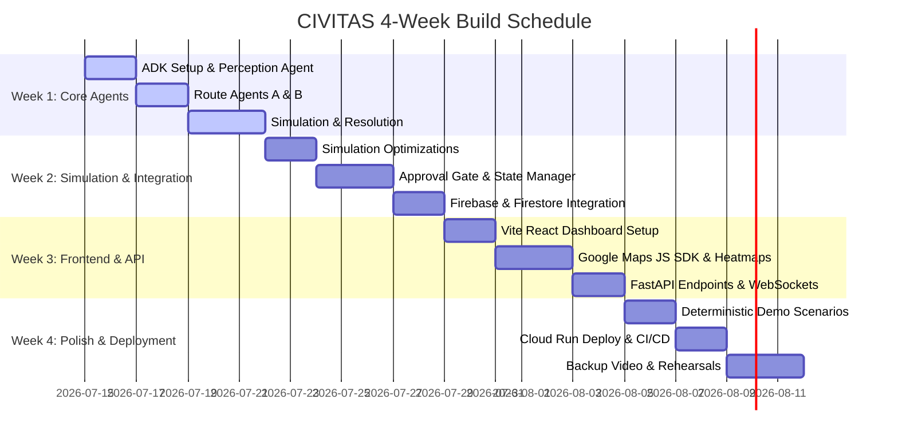

# CIVITAS — 4-Week Development Roadmap

This plan breaks down the development of the CIVITAS Emergency Traffic Coordinator over a realistic 4-week timeline.

---

## 1. Roadmap Overview

---

## 2. Week-by-Week Detail

### Week 1: Core Agent Functionality
**Goal**: Get Perception → Route Agents → Negotiation → Explainability working end-to-end via CLI on synthetic data.

#### Tasks:
| Task | Description | Priority | Owner | Output |
|---|---|---|---|---|
| **ADK Setup** | Initialize ADK project, configure Gemini API keys | HIGH | Dev 1 | `agents/pyproject.toml` |
| **Perception Agent** | Implement incident classification (Gemini Flash) | HIGH | Dev 1 | `agents/perception/agent.py` |
| **Route Agent A** | Implement speed-first routing agent (Flash) | HIGH | Dev 2 | `agents/route_agents/speed_first.py` |
| **Route Agent B** | Implement fairness-first routing agent (Flash) | HIGH | Dev 2 | `agents/route_agents/fairness_first.py` |
| **Google Maps Integration** | Heuristic wrapper or Maps API helper for routes | HIGH | Dev 1 | `backend/maps_client.py` |
| **Simulation Engine** | Build custom road network & lightweight traffic grid | HIGH | Dev 2 | `simulation/traffic_model.py` |
| **Negotiation Resolver** | Implement multi-objective scoring formula | HIGH | Dev 1 | `agents/negotiation/resolver.py` |
| **Explainability Agent** | Implement one-sentence natural explanation | MEDIUM | Dev 1 | `agents/explainability/agent.py` |
| **CLI Runner** | Orchestrate sequential pipeline execution via terminal | MEDIUM | Dev 1 | `agents/cli.py` |

#### Week 1 Acceptance Criteria:
- [ ] CLI executes all 6 agents from input to output in under 10 seconds.
- [ ] Perception Agent successfully extracts structured JSON from free-form text.
- [ ] Route Agents generate distinctive Speed-First vs. Fairness-First proposals.
- [ ] Resolver scores and ranks proposals deterministically.
- [ ] Unit tests covering agent classes yield >80% code coverage.

---

### Week 2: Simulation & Integration
**Goal**: Perfect the simulation engine, ensure deterministic scoring, add human approval gate, integrate with Firebase.

#### Tasks:
| Task | Description | Priority | Owner | Output |
|---|---|---|---|---|
| **Simulation Polish** | Optimize grid simulation execution to under 3 seconds | HIGH | Dev 2 | Optimized `simulation/` |
| **Heatmap Generator** | Render SVG or PNG congestion maps of the network | HIGH | Dev 2 | `simulation/render_heatmap.py` |
| **ADK Approval Gate** | Implement human approval workflow pause node in ADK | HIGH | Dev 1 | `agents/orchestrator/approval_gate.py` |
| **Firebase Integration** | Setup real-time event pipeline to Firestore/Realtime DB | HIGH | Dev 2 | `backend/firebase_client.py` |
| **Deterministic Mode** | Add seeded mock inputs to bypass API for demo day reliability | HIGH | Dev 1 | `agents/orchestrator/demo_mode.py` |

#### Week 2 Acceptance Criteria:
- [ ] Simulation evaluates scenarios and stores heatmaps on Firebase in under 3 seconds.
- [ ] The Human Approval Gate pauses the workflow and waits for Firestore update correctly.
- [ ] Retrying with the same incident results in identical resolution metrics (no random jitter).

---

### Week 3: Frontend + Google Integrations
**Goal**: Build the React dashboard with all screens, integrate Google Maps, ensure real-time updates work end-to-end.

#### Tasks:
| Task | Description | Priority | Owner | Output |
|---|---|---|---|---|
| **React Project Setup** | Initialize React/Vite/TypeScript project with Tailwind CSS | HIGH | Dev 2 | `frontend/package.json` |
| **Dashboard Layout** | Implement map overlay and sidebar for incident telemetry | HIGH | Dev 2 | `frontend/src/App.tsx` |
| **Google Maps View** | Render map layers, traffic, and vehicle animation components | HIGH | Dev 2 | `frontend/src/components/Map.tsx` |
| **Agent Thought Stream** | Implement live monospace terminal update feeds | HIGH | Dev 2 | `frontend/src/components/AgentStream.tsx` |
| **Proposal Cards** | Design comparisons and score bars | HIGH | Dev 2 | `frontend/src/components/ProposalComparison.tsx` |
| **FastAPI Backend Gateway** | Set up endpoints and WebSocket listeners | HIGH | Dev 1 | `backend/api/main.py` |

#### Week 3 Acceptance Criteria:
- [ ] Frontend successfully renders dashboard and connects to backend via WebSockets.
- [ ] Triggering an incident launches the real-time monospace streaming of agent thoughts.
- [ ] High-impact routing displays the Operator Approval Modal dialog.

---

### Week 4: Polish + Deployment + Demo Preparation
**Goal**: Zero-defect demo day. Deploy to Cloud Run. Record backup video. Rehearse extensively.

#### Tasks:
| Task | Description | Priority | Owner | Output |
|---|---|---|---|---|
| **GCP Cloud Run Deploy** | Containerize backend and agents, deploy to Cloud Run | HIGH | Dev 1 | Active service URLs |
| **Firebase Hosting Deploy** | Deploy React frontend assets to Firebase Hosting | HIGH | Dev 2 | Public web app domain |
| **CI/CD Integration** | Deploy Cloud Build triggers to auto-update on branch push | MEDIUM | Dev 1 | `deployment/cloud_build.yaml` |
| **Backup Demo Video** | Capture and edit a high-quality 90-second run | HIGH | Dev 2 | `demo_backup.mp4` |
| **Pitch & Rehearsal** | Rehearse pitch with precise visual timings | HIGH | Both | Perfected presentation |

#### Week 4 Acceptance Criteria:
- [ ] The public web app operates without runtime console exceptions.
- [ ] Incident routing finishes successfully, including Maps API calls.
- [ ] Rehearsals are run at least 3 times to guarantee the demo finishes in <2 minutes.
